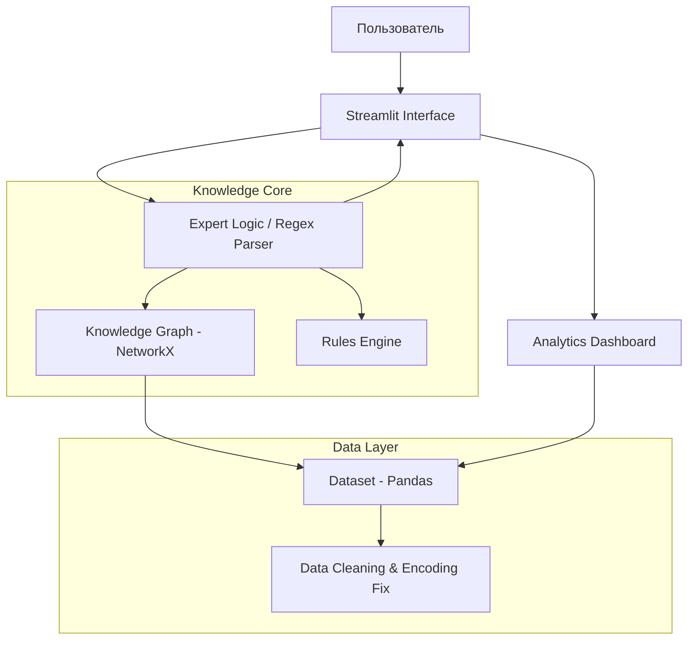

# 🌍 TourAgent Pro: Интеллектуальная система подбора туров

 
 

## 📌 Описание проекта
**TourAgent** — это интеллектуальное веб-приложение для автоматизации подбора туристических направлений. Система анализирует запросы пользователя на естественном языке, сопоставляет их с графом знаний и выдает персонализированные рекомендации.

В отличие от классических поисковых систем, проект реализует **гибридный подход**:
* **Граф знаний (Knowledge Graph):** Семантические связи между странами, направлениями и характеристиками туров.
* **Экспертная логика (Expert System):** Гибкая фильтрация по бизнес-правилам (бюджет, тип отдыха).
* **Data-Driven архитектура:** Полное отделение логики от данных.

---

## 🛠 Технологический стек
* **Streamlit:** Веб-интерфейс и интерактивные панели.
* **Pandas:** Загрузка и аналитическая обработка данных.
* **NetworkX:** Построение и навигация по графовым структурам.
* **Regex (re):** Парсинг параметров бюджета из сообщений.

---

## 📐 Архитектура системы

🚀 Основной функционал
Интеллектуальный чат: Распознавание запросов (например, "хочу море до 1200$").

Парсинг параметров: Автоматическое извлечение бюджета с помощью регулярных выражений.

Отказоустойчивость: Защита от ошибок кодировки и «битых» строк в CSV.

Аналитический дашборд: Визуализация цен и рейтингов.

Консультативный UI: Карточки туров с фото и контактами менеджера.

📦 Инструкция по запуску
Клонируйте репозиторий:
git clone [https://github.com/ваш-логин/TourAgent.git](https://github.com/ваш-логин/TourAgent.git)
cd TourAgent

2. Установите зависимости:
pip install streamlit pandas networkx matplotlib

3. Запустите приложение:
streamlit run src/main.py